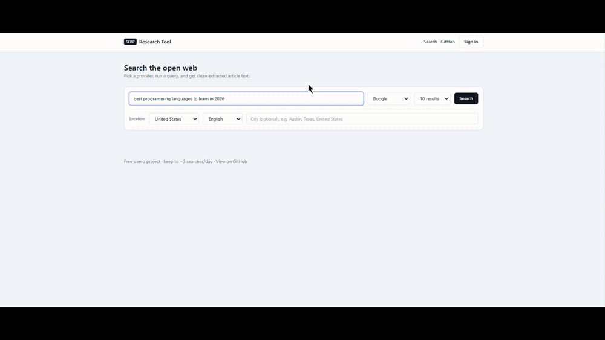

# SERP Research Tool

A full-stack web research platform: search the open web across multiple providers,
extract clean article text from every result, and pull the most salient entities on
demand — governed by a tiered quota engine, cost controls, and invite-only access.

**Live demo → https://serp-scraper-sigma.vercel.app/**



> Note: the demo runs on a free tier. The first request after a period of inactivity
> may take ~30–60s while the backend wakes up. It's a public demo — please keep usage
> light (≈3 searches/day) so others can try it too.

---

## What it does

- **Multi-provider search** — Google, Brave, and DuckDuckGo behind one interface;
  pick a provider per query. Results come from compliant search APIs, not home-grown
  SERP scraping or CAPTCHA circumvention.
- **Geo-targeting** — country, language, and **city-level** results (Google UULE
  encoding). The same query from different cities returns genuinely localized results.
- **Content extraction** — a headless browser fetches each result page and the main
  article text is extracted (boilerplate, nav, and ads stripped). Results **stream in
  over SSE** as each page finishes, each tagged extracted / blocked / error.
- **Entity extraction (top-10 by salience)** — an on-demand, per-result action.
  Tiered engine: free users get a fast local model; registered users get higher-quality
  salience scoring, with hard cost caps and graceful fallback.
- **Quota engine** — anonymous vs. registered tiers with atomic, Redis-backed
  rate-limiting, a shared borrow pool, a global spend kill-switch, automatic
  provider fallback with a circuit breaker, and query caching.
- **Invite-only auth** — no public signup; single-use, email-bound, expiring invite
  tokens (hashed at rest). The admin issues invites; recipients set their own password.
- **Admin dashboard** — manage users and invites; monitor provider health, cache hit
  rate, and per-engine usage / estimated spend.
- **Export** — download results as CSV or JSON.

## Stack

| Layer | Tech |
|-------|------|
| Frontend | Next.js (App Router, TypeScript) + Tailwind |
| Backend | FastAPI (async) |
| Extraction | Playwright + trafilatura |
| Entities | spaCy (local) · Google Cloud Natural Language · LLM-based extraction |
| Data | PostgreSQL (durable) + Redis (quota / cache / circuit breakers) |
| Deploy | Docker Compose (local) · Vercel (frontend) + Render (API) |

## Architecture

```
Next.js (Vercel)  ──HTTPS / SSE──►  FastAPI (Render container)
  search UI                          ├── search    → provider layer + fallback
  geo + entities                     ├── stream    → SSE extraction results
  admin / auth                       ├── entities  → tiered salience extraction
                                     ├── auth / invites
                                     └── admin
                                          │
                       ┌──────────────────┼───────────────────┐
                       ▼                  ▼                    ▼
                  Redis              PostgreSQL          search + NLP providers
            quota / cache /        users / invites
            breakers / caps
```

- Search providers implement one interface and return a normalized result shape, so
  adding or swapping a provider is isolated. A circuit breaker fails over between
  providers on quota/error.
- The quota engine uses atomic Redis counters (Lua) for race-free rate-limiting and a
  global kill-switch that stops billable calls at a hard cap — so the demo can't run
  up a surprise bill.
- Cost-bearing work (premium entity extraction) is metered by **character-based units
  against a monthly cap**, with automatic fallback to the free local engine once the
  cap is reached.

## Quick start (Docker)

```bash
cp backend/.env.example backend/.env     # set the admin password; add any keys you have
docker compose up --build
```

- Frontend → http://localhost:3000
- API docs (Swagger) → http://localhost:8000/docs

The bootstrap admin (`ADMIN_BOOTSTRAP_EMAIL` / `ADMIN_BOOTSTRAP_PASSWORD`) is seeded on
first run. Sign in, open **Admin → Invite a user**, and send the generated link.

**Zero-key demo:** DuckDuckGo search and local entity extraction work with no API keys.
Add keys (see `backend/.env.example`) to enable Google/Brave search and premium
entity scoring.

## Configuration

- **Secrets & provider keys** → `backend/.env` (see `backend/.env.example`).
- **Tier limits & cost caps** → `backend/limits.yaml` (anonymous vs. registered
  per-provider limits, fallback caps, and the entity-extraction monthly unit cap).

## Local development (without Docker)

**Backend**
```bash
cd backend
python -m venv .venv && source .venv/bin/activate   # Windows: .venv\Scripts\activate
pip install -r requirements.txt
python -m playwright install chromium
python -m spacy download en_core_web_sm
uvicorn app.main:app --reload      # requires PostgreSQL + Redis running
```

**Frontend**
```bash
cd frontend
npm install
cp .env.local.example .env.local   # set NEXT_PUBLIC_API_URL
npm run dev
```

## Deployment

- **Frontend** → Vercel (root directory `frontend`; set `NEXT_PUBLIC_API_URL` to the
  API URL).
- **Backend** → Render as a Docker container (Playwright + spaCy need a persistent
  process — not serverless-compatible). Honors the platform `$PORT`.
- **PostgreSQL** → any managed Postgres (e.g. Supabase / Neon). **Redis** → any
  managed Redis (e.g. Upstash).
- Set `FRONTEND_ORIGIN` on the API to the frontend URL for CORS.

## Notes

- DuckDuckGo is best for local/dev use; from a datacenter IP it is frequently
  bot-challenged, so the deployed app defaults to Google and degrades DuckDuckGo
  gracefully.
- Open-web extraction is inherently imperfect — some sites block automated fetches, so
  a portion of results will show as blocked/error by design. Each result reports its
  own status rather than failing the whole search.
